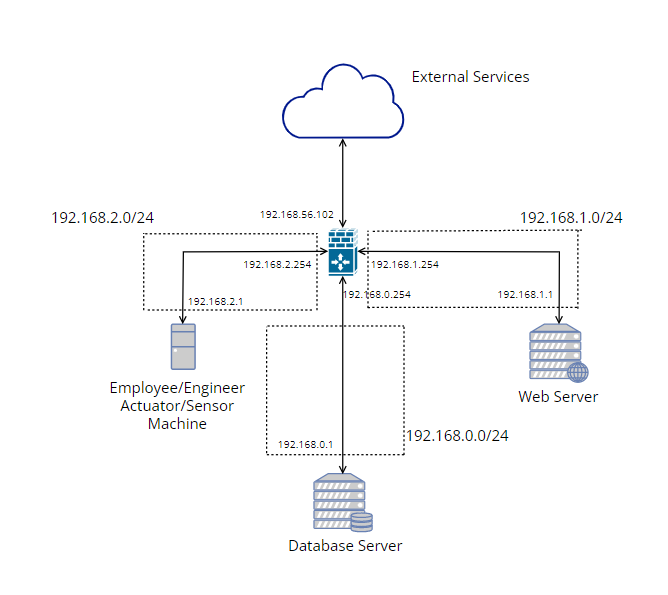

# StarDrive

The developed application is meant to facilitate StarDrive's management of the factory's production process. It provides the employees an interface to consult information on their job status, a dashboard to monitor the production process and statistics and an interface for managing employees and controlling more details of the production process of self-driving and remote control vehicles.

## Getting Started

These instructions will get you a copy of the project up and running on your local machine for development purposes. See deployment for notes on how to deploy the project on a live system.

### Prerequisites
- Jdk 17
- Node.js v18.12.1
- Node Package Manager (npm) v8.19.2
- Gradle v7.6 (Optional)
- MongoDB >= v4
- Docker
- Nix Package Manager (Optional)

### Installing

#### Using the Nix Package Manager (Recommended)

```sh
# From the root of the repository
nix develop --experimental-features 'nix-command flakes'

# MongoDB
sudo docker run -p 27017:27017 -d mongo

# Backend (inside the backend directory)
gradle bootRun

# Frontend (inside the frontend directory)
npm run dev
```

#### Ubuntu 20.04

```sh
sudo apt-get update -qq --yes && sudo apt-get install -qq --yes openjdk-17-jdk \
                                                            nodejs npm gradle \
                                                            python3 python3-pip \
                                                            python3-venv
# MongoDB
sudo docker run -p 27017:27017 -d mongo

# Python for the actuarors / sensors
python3 -m venv stardrive_venv
source stardrive_venv/bin/activate
pip install requests pycryptodome

# Backend (inside the backend directory)
./gradlew bootRun

# Frontend (inside the frontend directory)
npm run dev
```

## Deployment

We are considering deployment in a structure similar to ours:



The Network Interfaces are configured as follows:

They can be copied `/etc/netplan/01-network-manager-all.yaml` and applied with `sudo netplan try ; sudo netplan apply`
```yaml
# MongoDB
network:
  version: 2
  renderer: NetworkManager
  ethernets:
      enp0s3:
          addresses:
              - 192.168.0.1/24
          routes:
              - to: 192.168.1.0/24
                via: 192.168.0.254
```

```yaml
# firewall / router
network:
  version: 2
  renderer: NetworkManager
  ethernets:
      enp0s3:
          addresses:
              - 192.168.2.254/24
      enp0s8:
          addresses:
              - 192.168.0.254/24
      enp0s9:
          addresses:
              - 192.168.1.254/24
```

```yaml
# Internal Machine (Employee & Engineer Client, Actuators & Sensors)
network:
  version: 2
  renderer: NetworkManager
  ethernets:
      enp0s3:
          addresses:
              - 192.168.2.1/24
```

```yaml
# Web Server
network:
  version: 2
  renderer: NetworkManager
  ethernets:
      enp0s3:
          addresses:
              - 192.168.1.1/24
          routes:
              - to: 192.168.0.0/16
                via: 192.168.1.254
```

The firewalls are configured as follows:

These commands can be used with the bash shell
```sh
# Database Server
sudo iptables -F
sudo iptables -P INPUT DROP
sudo iptables -P FORWARD DROP
sudo iptables -P OUTPUT DROP
sudo iptables -A INPUT -p tcp -s 192.168.1.1 -m tcp --dport 27017  -j ACCEPT
sudo iptables -A OUTPUT -p tcp -d 192.168.1.1 -j ACCEPT

sudo sh -c 'iptables-save > /etc/iptables/rules.v4'
```

```sh
# Firewall / Router
sudo sysctl net.ipv4.ip_forward=1
sysctl net.ipv4.conf.all.forwarding

sudo iptables -F
sudo iptables -t nat -F
sudo iptables -P INPUT DROP
sudo iptables -P FORWARD DROP
sudo iptables -P OUTPUT DROP
sudo iptables -t nat -A PREROUTING -p tcp -m tcp --dport 80 -j DNAT --to-destination 192.168.1.1:443
sudo iptables -t nat -A PREROUTING -p tcp -m tcp --dport 443 -j DNAT --to-destination 192.168.1.1
sudo iptables -A FORWARD -p tcp -m tcp --dport 80 -j ACCEPT
sudo iptables -A FORWARD -p tcp -m tcp --dport 443 -j ACCEPT
sudo iptables -A FORWARD -s 192.168.1.1/32 -i enp0s9 -p tcp -j ACCEPT
sudo iptables -A FORWARD -s 192.168.0.1/32 -i enp0s8 -p tcp -j ACCEPT
sudo iptables -A FORWARD -s 192.168.56.0/24 -i enp0s10 -p tcp -j ACCEPT

sudo sh -c 'iptables-save > /etc/iptables/rules.v4'
```

```sh
# Internal Machine (Employee & Engineer Client, Actuators & Sensors)
sudo iptables -F
sudo iptables -P INPUT DROP
sudo iptables -P FORWARD DROP
sudo iptables -P OUTPUT DROP
sudo iptables -A INPUT -p tcp -s 192.168.2.254 -j ACCEPT
sudo iptables -A OUTPUT -p tcp -d 192.168.2.254 --dport 443 -j ACCEPT
sudo iptables -A OUTPUT -p tcp -d 192.168.2.254 --dport 80 -j ACCEPT

sudo sh -c 'iptables-save > /etc/iptables/rules.v4'
```

```sh
# Web Server
sudo iptables -F
sudo iptables -P INPUT DROP
sudo iptables -P FORWARD DROP
sudo iptables -P OUTPUT DROP
sudo iptables -A OUTPUT -p tcp -j ACCEPT
sudo iptables -A INPUT -p tcp -j ACCEPT

sudo sh -c 'iptables-save > /etc/iptables/rules.v4'
```

For deploying this, we are currently using the [Caddy web server](https://caddyserver.com/), with the following config:

```
:443

tls ./certs/webserver.crt ./certs/webserver.key

@remote {
    not remote_ip 192.168.2.0/24
}

route /api/auth/* {
    uri strip_prefix /api
    reverse_proxy :8080
}

route /api/external/* {
    uri strip_prefix /api
    reverse_proxy :8080
}

route /api/* {
    respond @remote "Unauthorized" 403
    uri strip_prefix /api
    reverse_proxy :8080
}

route @remote {
    root * /home/vasco/public
    try_files {path} /index.html
    file_server
}

route {
    root * /home/vasco/private
    try_files {path} /index.html
    file_server
}
```

This config can be adapted. We serve two different versions of the frontend, one doesn't include views that should only be accessible to users connected to the company's private network and one that includes. If a user not connected to the company's private network attempts to access api endpoints other than authentication and auditing.

Other web servers can also be used, similar configurations should be possible.

## Built With

* [Spring Boot](https://spring.io/projects/spring-boot) - The web framework used for the backend
* [Kotlin](https://kotlinlang.org/) - The language used in the backend
* [Gradle](https://gradle.org/) - Dependency Management and build tool for the backend
* [NPM](https://www.npmjs.com/) - Dependency Management for the frontend
* [VueJS](https://vuejs.org/) - The frontend framework we used
* [Python](https://www.python.org/) - The language used for the actuator and sensor scripts

## Authors

* **Eduardo Espadeiro** - 95568
* **Guilherme Salvador** - 95584
* **Vasco Correia** - 94188
